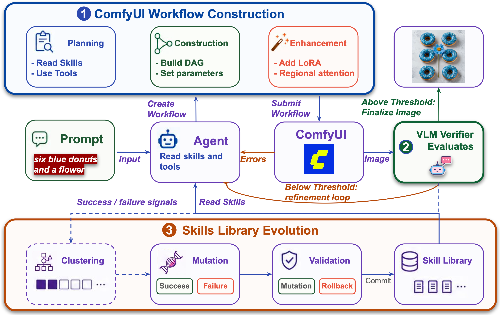

<h1 align="center">ComfyClaw</h1>

<p align="center">
  <strong>Agentic harness for skill-evolving ComfyUI image-generation workflows</strong>
</p>

<p align="center">
  <a href="https://zli12321.github.io/"><strong>Zongxia Li</strong></a><sup>*</sup> &middot; 
  <a href="https://davidliuk.github.io/"><strong>Dawei Liu</strong></a><sup>*</sup> &middot; 
  <strong>Jingxi Chen</strong></a> &middot; 
  <strong>Xiyang Wu</strong></a> &middot; 
  <strong>Fuxiao Liu</strong></a> &middot; 
  <strong>Yuhang Zhou</strong></a> &middot; 
  <strong>Jing Xie</strong></a> &middot; 
  <strong>Xiaomin Wu</strong></a> &middot; 
  <a href="https://lichao-sun.github.io/"><strong>Lichao Sun</strong></a>
</p>


<!-- [](https://github.com/Moms-Organic-Agent-Lab/comfyclaw/actions/workflows/ci.yml)
[](https://python.org)
[](https://github.com/astral-sh/uv)
[](LICENSE) -->

ComfyClaw is the reference implementation of the paper
*“An Agentic Harness for Skill-Evolving Image Generation Workflows”*
(Li, Liu, Chen, Wu, Liu, Zhou, Xie, Wu, Sun, 2026). It is an **agentic
harness** that controls an *unmodified* ComfyUI runtime: workflow
construction is framed as **typed graph editing**, a **stage-gated**
router exposes tools safely and rolls back invalid edits, and a
**region-level VLM verifier** turns visual failures into localised
repair suggestions. Successful trajectories, execution errors, and
verifier feedback are then distilled into a **progressively disclosed
skill library** — Agent Skills are committed only after held-out
validation, so workflow competence accumulates across runs instead of
being rediscovered on every prompt.

Across four text-to-image benchmark splits, three agent models, and
two image backbones, ComfyClaw achieves the best average score in all
six agent–backbone settings, improves over a verifier-only baseline
without skill evolution by ~10 points in the strongest setting
(61.09 → 76.34), is preferred by human annotators on 2,400 rated
images, and accumulates **318 evolved skills** that account for roughly
half of all later skill reads. See [Results at a glance](#results-at-a-glance)
or the paper for the full tables.

> 📄 **Paper:** *An Agentic Harness for Skill-Evolving Image Generation Workflows.*
> Citation block — see [Citing ComfyClaw](#citing-comfyclaw) below or
> [`CITATION.cff`](CITATION.cff).

### Key features

- **Generate from ComfyUI** — type a prompt, click Generate in the built-in
  panel, and watch the agent work — no terminal interaction needed
- **Build from scratch or evolve** — the agent can construct an entire ComfyUI
  workflow from zero or iterate on an existing one
- **Incremental visualization** — watch nodes appear one-by-one on the ComfyUI
  canvas as the agent builds
- **Manual / Auto / Co-pilot run modes** — pick the right level of automation:
  Manual (single round, no verifier), Auto (full VLM-driven self-optimization
  loop), or Co-pilot (VLM scoring + human accept-or-override per iteration)
- **Live scoreboard** — every iteration emits a score card with delta-vs-prev,
  verifier critique, and an "Accept now" button to stop early
- **Tabbed panel** — Generate (prompt + mode + log), Skills (browse/import/
  enable), History (image gallery + iteration timeline)
- **Skills marketplace** — bundled skills, plus import from local folder, .zip
  upload, or `git clone` URL; toggle each on or off without restarting
- **Pluggable agent backends** — drive the tool-use loop through any LiteLLM
  provider _or_ a CLI agent: Anthropic's `claude`, OpenAI's `codex`, or
  Google's `gemini`. CLI backends pipe `tools` and tool-results over a
  persistent JSON-stream session
- **Human-in-the-loop** — give subjective feedback directly from the ComfyUI
  panel after generation: thumbs up/down, optional comments, and opt-in skill
  evolution from good and bad cases
- **Any LLM, any provider** — swap agent and verifier models independently via
  [LiteLLM](https://docs.litellm.ai/docs/providers) (Anthropic, OpenAI, Gemini,
  Ollama, 100+ more)

<p align="center">
  
</p>

<p align="center"><em>
<strong>Figure 1 · Overall framework of ComfyClaw.</strong> The agent edits
a ComfyUI workflow graph through three stage-gated phases —
<strong>Planning</strong>, <strong>Construction</strong>, and
<strong>Enhancement</strong> (1). The runtime renders a candidate image; a
region-level VLM verifier (2) returns requirement-level pass/fail labels
and a holistic detail score, which the harness combines into a scalar
reward. Below threshold, the failure feedback drives a refinement loop;
above threshold, the trajectory is committed and passed to the
skill-evolution module (3), which clusters successes and failures,
proposes mutations (<code>create / revise / reinforce / merge / delete</code>),
and commits only those that pass held-out validation.
</em></p>

---

## Table of contents

- [Results at a glance](#results-at-a-glance)
- [Quick start](#quick-start)
- [Installation](#installation)
- [Usage guide](#usage-guide)
  - [Local ComfyUI app](#local-comfyui-app)
  - [Deployed ComfyUI](#deployed-comfyui)
  - [CLI run — one-shot from terminal](#cli-run--one-shot-from-terminal)
- [CLI reference](#cli-reference)
- [Python API](#python-api)
- [Architecture](#architecture)
- [Skills](#skills)
- [Development](#development)
- [Project structure](#project-structure)
- [Reproducing the paper](#reproducing-the-paper)
- [Citing ComfyClaw](#citing-comfyclaw)

---

## Results at a glance

**Quantitative.** ComfyClaw is evaluated on four text-to-image benchmark
splits — GenEval2, DPG-Bench, OneIG-EN, and OneIG-ZH — using three agent
models (Claude Sonnet 4.5, Qwen-3.6-35B-A3B, Gemma-4-E4B-it) and two
image backbones (Z-Image-Turbo, LongCat-Image). Headline numbers
(Table 1 in the paper, Soft-TIFA / VQAScore averaged):

| Setting | BASE | ComfyGEMS *(no skill evolution)* | **ComfyClaw** |
|---|---:|---:|---:|
| Claude Sonnet 4.5 + Z-Image-Turbo | 67.94 | 73.93 | **77.78** |
| Claude Sonnet 4.5 + LongCat-Image | 67.08 | 75.13 | **75.52** |
| Qwen-3.6-35B + Z-Image-Turbo | 63.84 | 70.23 | **78.62** |
| Qwen-3.6-35B + LongCat-Image | 65.05 | 65.51 | **76.34** |
| Gemma-4-E4B + Z-Image-Turbo | 60.84 | 60.84 | **65.01** |
| Gemma-4-E4B + LongCat-Image | 39.07 | 34.28 | **43.94** |

ComfyClaw posts the best average in **all six** agent–backbone settings,
improves over the verifier-only `ComfyGEMS` ablation by ≈ 4 points and
over the no-refinement `Base` by ≈ 10 points on average, and is
preferred by human annotators on a 2,400-image study (Table 2 in the
paper). Across the Claude-Sonnet runs the harness accumulates
**318 unique evolved skills (4,768 versions)**, and on dense /
compositional benchmarks these evolved skills account for **56–70 %**
of all skill reads.

**Qualitative.**

<p align="center">
  
</p>

<p align="center"><em>
<strong>Figure 3 · Qualitative comparison across methods on six prompts
spanning five capability categories.</strong> Each column is a prompt
(header shows the category and full description); rows are
<strong>Base</strong> (single-pass baseline), <strong>ComfyGEMS</strong>
(ComfyClaw without skill evolution), and <strong>Ours</strong>
(ComfyClaw, green border). ComfyClaw more reliably realises object
counts, spatial relations, scene-text accuracy, and fine-grained
attribute control. See <a href="docs/REPRODUCING.md"><code>docs/REPRODUCING.md</code></a>
for the exact commands used to produce these images.
</em></p>

---

## Quick start

ComfyClaw is managed with `uv`. The usual workflow is: install the Python
package, install the bundled ComfyUI plugin once, then run the ComfyClaw server
while using ComfyUI.

```bash
git clone https://github.com/Moms-Organic-Agent-Lab/comfyclaw.git
cd comfyclaw
uv sync --extra sync

cp .env.example .env
$EDITOR .env

uv run comfyclaw install-node
# Restart ComfyUI after this step.

uv run comfyclaw serve
```

Open ComfyUI, usually `http://127.0.0.1:8188`. The ComfyClaw panel appears in
the ComfyUI UI. Enter a prompt, choose **Scratch** or **Improve**, and click
**Generate**.

CLI-only run:

```bash
uv run comfyclaw run --prompt "a red fox at dawn, photorealistic, DSLR"
```

---

## Installation

### Prerequisites

| Requirement | Notes |
|---|---|
| **Python 3.10+** | 3.12+ recommended |
| **[ComfyUI](https://github.com/comfyanonymous/ComfyUI)** | Desktop app, local checkout, or deployed server reachable over HTTP |
| **A generation model in ComfyUI** | ComfyClaw builds workflows, but ComfyUI still needs the referenced checkpoints / LoRAs / VAEs |
| **An agent backend** | LiteLLM with a provider API key, local Ollama, or a signed-in CLI backend (`claude`, `codex`, `gemini`) |

### Install

```bash
git clone https://github.com/Moms-Organic-Agent-Lab/comfyclaw.git
cd comfyclaw
uv sync --extra sync
```

Useful `uv` variants:

```bash
uv sync --extra all          # sync + video support
uv sync --group dev          # development tools
```

### Configure

```bash
cp .env.example .env
$EDITOR .env
```

Set `COMFYUI_ADDR`, optionally `COMFYUI_DIR`, and either a LiteLLM provider key
or a CLI backend. `.env` is loaded automatically; CLI flags override it.

### Install the ComfyUI plugin

For a local ComfyUI app or checkout:

```bash
uv run comfyclaw install-node
uv run comfyclaw install-node --comfyui-dir /path/to/ComfyUI
```

Restart ComfyUI after installation. For remote/deployed ComfyUI, copy the
directory printed by `uv run comfyclaw node-path` into the remote
`custom_nodes/ComfyClaw-Sync` directory and restart that server.

```bash
uv run comfyclaw doctor
uv run comfyclaw serve
```

Local LLM and model-bundle helpers:

```bash
uv run comfyclaw configure-local-llm --provider vllm --model Qwen/Qwen3.6-27B --api-base http://127.0.0.1:18000/v1 --check --write-env
uv run comfyclaw models list
uv run comfyclaw models download wan22-t2v
uv run comfyclaw models download qwen-image-2512 --include-optional
```

See [`docs/USAGE.md`](docs/USAGE.md) for remote networking, panel controls,
CLI backends, skills, and troubleshooting. See
[`docs/LOCAL_LLM_AND_MODELS.md`](docs/LOCAL_LLM_AND_MODELS.md) for local vLLM,
Wan2.2 video, and Qwen-Image setup.

---

## Usage guide

Full guide: [`docs/USAGE.md`](docs/USAGE.md).

### Local ComfyUI app

Install the plugin once, restart ComfyUI, then keep the server running:

```bash
uv run comfyclaw install-node
uv run comfyclaw serve
```

Panel basics: **Scratch** builds a new workflow, **Improve** edits the current
canvas, **Manual** runs one pass, **Auto** runs verifier-guided iterations, and
**Co-pilot** asks for human approval.

### Deployed ComfyUI

ComfyClaw can drive an unmodified deployed ComfyUI over HTTP, but the browser
panel requires the plugin to be installed in that ComfyUI instance.

```bash
uv run comfyclaw node-path
# Copy that directory to <remote ComfyUI>/custom_nodes/ComfyClaw-Sync.
uv run comfyclaw serve --comfyui-addr comfyui.example.com:8188
```

The browser must be able to reach the ComfyClaw WebSocket port, default
`8765`. Use an SSH tunnel or reverse proxy if needed. If you cannot install the
plugin, use CLI mode against `--comfyui-addr`.

### CLI run — one-shot from terminal

```bash
uv run comfyclaw run \
  --prompt "a red fox at dawn, photorealistic, DSLR" \
  --iterations 3

uv run comfyclaw run \
  --workflow my_workflow_api.json \
  --prompt "make this workflow render a rainy neon street"

uv run comfyclaw dry-run --prompt "build a portrait workflow"
```

Outputs are saved under `./comfyclaw_output/` unless `--output-dir` is set.

---

## CLI reference

```
uv run comfyclaw doctor        Pre-flight check
uv run comfyclaw serve         Start panel-driven server
uv run comfyclaw run           One-shot generation
uv run comfyclaw dry-run       Build workflow only
uv run comfyclaw serve-video   Server with video mode default
uv run comfyclaw run-video     One-shot video generation
uv run comfyclaw install-node  Install ComfyUI plugin
uv run comfyclaw node-path     Print bundled plugin path
uv run comfyclaw models        Manage known ComfyUI model bundles
uv run comfyclaw configure-local-llm
```

Common flags:

| Flag | Default | Description |
|---|---|---|
| `--comfyui-addr HOST:PORT` | `127.0.0.1:8188` | ComfyUI server address (or set `COMFYUI_ADDR` env var) |
| `--workflow PATH` | *(optional)* | API-format workflow JSON; omit to build from scratch |
| `--prompt TEXT` | *(required for run/dry-run; ignored by serve)* | Image generation prompt; in serve mode the prompt comes from the ComfyUI panel |
| `--model MODEL` | `anthropic/claude-sonnet-4-5` | LiteLLM model for the agent |
| `--verifier-model MODEL` | *(same as --model)* | LiteLLM model for the vision verifier |
| `--verifier-mode MODE` | `vlm` | `vlm`, `human`, or `hybrid` |
| `--mode MODE` | `auto` | Run mode: `manual` (single round, no verifier), `auto` (full VLM loop), `copilot` (VLM + human approval) |
| `--agent-backend BACKEND` | `litellm` | Agent driver: `litellm`, `claude-code`, `codex`, `gemini-cli` (CLI options need the matching binary on `$PATH`) |
| `--image-model NAME` | *(from workflow)* | Pin ComfyUI checkpoint filename |
| `--iterations N` | `3` | Max agent–generate–verify cycles |
| `--threshold SCORE` | `0.85` | Stop early when score ≥ threshold |
| `--max-repair-attempts N` | `2` | Auto-repair attempts per iteration |
| `--sync-port PORT` | `8765` | WebSocket port for live sync |
| `--no-sync` | off | Disable live sync |
| `--skills-dir DIR` | *(built-in)* | Custom skill directory |
| `--no-skill-evolution` | off | Disable post-run skill proposal from run evidence and human feedback |
| `--skill-evolution-min-confidence N` | `0.55` | Minimum proposal confidence before asking to apply a skill update |
| `--auto-apply-skill-evolution` | off | Apply proposed skill changes without confirmation; intended for offline experiments |
| `--reset-each-iter` | off | Reset to base workflow each iteration |
| `--output-dir DIR` | `./comfyclaw_output/` | Where to save the best image |
| `--debug-no-generate` | off | Build the workflow but skip ComfyUI execution |
| `--modality image\|video` | `image` | Output type; video subcommands default to `video` |
| `--video-frames N` | `6` | Frames sampled by the video verifier |

Use `uv run comfyclaw <command> --help` for the full option list.

---

## Python API

```python
from comfyclaw import ClawHarness, HarnessConfig

cfg = HarnessConfig(
    server_address="127.0.0.1:8188",
    model="anthropic/claude-sonnet-4-5",
    max_iterations=3,
    success_threshold=0.85,
)

# From a workflow file
with ClawHarness.from_workflow_file(
    "examples/workflows/sd15_dreamshaper_lcm.json", cfg
) as h:
    image_bytes = h.run("a red fox at dawn, photorealistic")

# Or build from scratch (empty dict)
with ClawHarness.from_workflow_dict({}, cfg) as h:
    image_bytes = h.run("a red fox at dawn, photorealistic")

if image_bytes:
    open("output.png", "wb").write(image_bytes)
```

For lower-level graph editing, use `WorkflowManager`; for direct ComfyUI
HTTP calls, use `ComfyClient`. See [`docs/ARCHITECTURE.md`](docs/ARCHITECTURE.md)
for the code map.

---

## Architecture

ComfyClaw wraps an unmodified ComfyUI server and interacts with it through
public HTTP/WebSocket APIs.

| Component | Role |
|---|---|
| Harness | Orchestrates agent -> ComfyUI -> verifier iterations |
| Agent | Edits workflows through typed graph tools |
| Verifier | Scores images or videos and returns repair feedback |
| Skills | Progressive-disclosure recipes loaded on demand |
| Sync server | Connects the Python loop to the ComfyUI panel |

For implementation details, see [`docs/ARCHITECTURE.md`](docs/ARCHITECTURE.md).

---

## Skills

ComfyClaw's skills follow the [Agent Skills spec](https://agentskills.dev/specification).
Each skill is a directory with a `SKILL.md` file containing YAML frontmatter.

**Progressive disclosure** keeps context lean:
1. **Startup** — only `name` + `description` from frontmatter appear in the system prompt
2. **On demand** — agent calls `read_skill("name")` to load full instructions

### Built-in skills

| Skill | When activated |
|---|---|
| `workflow-builder` | Building from scratch (architecture recipes + slot reference) |
| `qwen-image-2512` | Qwen-Image-2512 model (Lightning 4-step pipeline) |
| `high-quality` | "high quality", "sharp", "detailed", "8K" |
| `photorealistic` | "photo", "DSLR", "realistic", "cinematic" |
| `creative` | "creative", "artistic", "fantasy", "concept art" |
| `aesthetic-drawing` | "masterpiece", "award-winning", "professional art" |
| `creative-drawing` | "cool", "dreamy", "futuristic" |
| `lora-enhancement` | Texture / lighting / anatomy defects |
| `controlnet-control` | Flat background, blurry edges, wrong pose |
| `regional-control` | Subject–background style bleed |
| `hires-fix` | Low resolution, soft detail |
| `spatial` | Multiple objects with spatial relationships |
| `text-rendering` | Quoted text, signs, labels |

### Adding custom skills

```
my_skills/
└── portrait-lighting/
    └── SKILL.md
```

```markdown
---
name: portrait-lighting
description: >-
  Optimise lighting for portrait photography. Activate when the user mentions
  "portrait", "face", "studio lighting".
---

1. Append `, dramatic studio lighting, rim light, catchlights` to the positive prompt.
2. Set KSampler CFG to 8.0–9.0.
3. Consider adding a normal-map ControlNet for skin texture depth.
```

```bash
uv run comfyclaw run --prompt "..." --skills-dir ./my_skills/
```

### Managing skills from the panel

Open the **Skills** tab in the ComfyClaw panel (next to Generate / History) for
a full browser:

| Action | What it does |
|---|---|
| Toggle | Enable/disable a skill on the fly (state persists across restarts) |
| **+ Folder** | Copy a local folder containing `SKILL.md` into `~/.comfyclaw/skills/` |
| **+ .zip** | Drop in a packaged skill — must contain exactly one top-level dir |
| **+ Git URL** | `git clone --depth=1` the repo and import its top-level `SKILL.md` |
| 📖 (view) | Open the `SKILL.md` body in a modal viewer |
| ✕ (delete) | Remove an imported skill from disk (built-ins can be disabled but never deleted) |

Imports persist under `~/.comfyclaw/skills/` (override with
`COMFYCLAW_USER_SKILLS_DIR`).  An adjacent `skills_state.json` records the
enabled flag and source (`builtin` / `local` / `zip` / `git`) for every skill.

### Post-run skill evolution

After a generation is verified, the panel can ask for human feedback on the
result. The reviewer can mark it as a thumbs-up good case or a thumbs-down bad
case, add a comment, and choose whether that feedback should be used for skill
evolution. Good cases are distilled into reusable workflow and prompt tactics;
bad cases are distilled into failure modes and repair protocols.

When ComfyClaw finds a reusable lesson, it proposes a new user skill or an
update to an existing skill. By default the proposal is shown for approval
before anything is written. Approved skills are stored with the normal imported
skills under `~/.comfyclaw/skills/`, then the running skill registry is reloaded.

---

## Workflow format

ComfyClaw uses the **API format** (not the UI format):

```json
{
  "1": {
    "class_type": "CheckpointLoaderSimple",
    "_meta": { "title": "Load Checkpoint" },
    "inputs": { "ckpt_name": "v1-5-pruned.ckpt" }
  },
  "2": {
    "class_type": "CLIPTextEncode",
    "inputs": { "clip": ["1", 1], "text": "a red fox" }
  }
}
```

Export from ComfyUI: **Workflow → Export (API)** in the menu.

`from_workflow_file()` also handles prompt-keyed saves (`{"prompt": {...}}`)
and UI format (looks for sibling `*_api.json`; falls back to conversion).

---

## Development

See [CONTRIBUTING.md](CONTRIBUTING.md) for the full guide.
Maintainers: see [docs/RELEASE.md](docs/RELEASE.md) for the release
procedure (single-commit snapshot of this tree into the public repo).

```bash
uv sync --group dev
uv run pytest -ra -q
uv run ruff check --fix .
uv run ruff format .
uv build
```

---

## Project structure

```
comfyclaw/
├── pyproject.toml
├── .env.example                    environment configuration template
├── README.md                       this file
├── CITATION.cff                    BibTeX / Zenodo metadata for the paper
├── CHANGELOG.md                    versioned change log
├── CONTRIBUTING.md                 dev setup, hooks, PR workflow
├── LICENSE                         MIT
├── assets/                         paper figures embedded in this README
│   ├── framework.png/.pdf          system overview
│   ├── cherrypick.png              qualitative comparison
│   └── refinement.png              iterative refinement walkthrough
├── docs/
│   ├── USAGE.md                    user guide: app, deployed ComfyUI, CLI, skills
│   ├── ARCHITECTURE.md             paper-section → code-symbol map
│   ├── REPRODUCING.md              step-by-step reproducibility guide
│   └── RELEASE.md                  maintainer release flow
├── examples/
│   ├── README.md                   what's in here, how to run
│   ├── demo_incremental.py         standalone live-sync demo
│   └── workflows/                  API-format ComfyUI workflows
│       ├── sd15_dreamshaper_lcm.json
│       ├── qwen_image_2512.json
│       └── qwen_image_2512.ui.json
├── comfyclaw/                      the Python package
│   ├── __init__.py                 Public re-exports
│   ├── cli.py                      CLI entry point (run / serve / dry-run / install-node)
│   ├── harness.py                  ClawHarness — orchestrates the agent loop
│   ├── agent.py                    ClawAgent — LLM tool-use loop (16 typed actions)
│   ├── chat_agent.py               In-panel chat-style refinement agent
│   ├── debug_agent.py              Build-workflow-only (no image) agent
│   ├── verifier.py                 ClawVerifier — vision LLM scoring
│   ├── human_verifier.py           HumanVerifier + HybridVerifier
│   ├── workflow.py                 WorkflowManager — graph mutations + validation
│   ├── client.py                   ComfyClient — HTTP + polling
│   ├── memory.py                   ClawMemory — per-run attempt history
│   ├── sync_server.py              SyncServer — per-connection WebSocket bridge
│   ├── skill_manager.py            SkillsRegistry — Agent-Skills-spec loader
│   ├── agent_backends/             Pluggable agent drivers
│   │   ├── base.py                 AgentBackend / ToolCall / probe_all
│   │   ├── litellm_backend.py      default driver (any LiteLLM provider)
│   │   ├── claude_code_backend.py  Anthropic `claude` CLI
│   │   ├── codex_backend.py        OpenAI `codex` CLI
│   │   └── gemini_backend.py       Google `gemini` CLI
│   ├── custom_node/                Bundled ComfyUI plugin (ComfyClaw-Sync)
│   │   ├── __init__.py
│   │   └── js/                     panel + sync + skill-browser JS
│   └── skills/                     Built-in skills (Agent Skills spec)
│       ├── workflow-builder/       Architecture recipes
│       ├── qwen-image-2512/        Qwen model config
│       ├── photorealistic/         … and 17 more
│       └── ...
└── tests/                          227 tests (all offline, < 1 s)
    ├── conftest.py
    ├── test_agent.py
    ├── test_agent_backends.py
    ├── test_harness.py
    ├── test_human_verifier.py
    ├── test_memory.py
    ├── test_skill_manager.py
    ├── test_skills_registry.py
    ├── test_sync_server.py
    ├── test_verifier.py
    └── test_workflow.py
```

---

## Known constraints

- **Apple MPS + FP8 models**: `Float8_e4m3fn` is not supported on Apple Silicon.
  The agent auto-detects and repairs by setting `weight_dtype: "default"`. If the
  model file is natively fp8, the hardware incompatibility persists.
- **Serve mode requires WebSocket**: Do not use `--no-sync` with `comfyclaw serve`.
- **Auto-repair**: Up to `--max-repair-attempts` (default 2) per iteration.
  Transient infrastructure faults (e.g. BrokenPipe) are retried once
  automatically.
- **ComfyUI versions**: The JS extension tries `app.loadApiJson` (≥ 0.2),
  `app.loadGraphData`, and `app.graph.configure` in order.
- **Workflow format**: Only API format is sent to `/prompt`. UI format is
  converted on load.

---

## Reproducing the paper

The reproducibility guide lives at [`docs/REPRODUCING.md`](docs/REPRODUCING.md).
It walks through:

- the exact ComfyUI / Python / `uv` versions used for the paper results;
- which checkpoints, LoRAs, and VAEs to download (Qwen-Image-2512,
  DreamShaper-LCM, etc.);
- the CLI commands used for each headline experiment, including the
  expected verifier scores and iteration counts;
- how to swap agent and verifier backends to reproduce the multi-provider
  ablations.

For a concept-level map from paper sections to source files and symbols,
see [`docs/ARCHITECTURE.md`](docs/ARCHITECTURE.md).

---

## Citing ComfyClaw

If you use ComfyClaw in academic work, please cite the paper:

```bibtex
@article{li2026comfyclaw,
  title   = {An Agentic Harness for Skill-Evolving Image Generation Workflows},
  author  = {Li, Zongxia and Liu, Dawei and Chen, Jingxi and Wu, Xiyang and
             Liu, Fuxiao and Zhou, Yuhang and Xie, Jing and Wu, Xiaomin and
             Sun, Lichao},
  journal = {TBD},
  year    = {2026},
  note    = {Software available at \url{https://github.com/Moms-Organic-Agent-Lab/comfyclaw}}
}
```

Machine-readable metadata in CFF format is provided in
[`CITATION.cff`](CITATION.cff). Please update the BibTeX entry above with the
final venue / DOI once the paper is posted.
