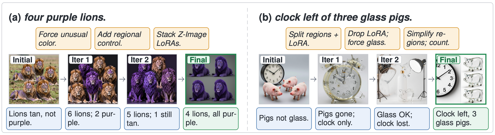

<h1 align="center">ComfyClaw</h1>

<p align="center">
  <strong>Agentic harness for skill-evolving ComfyUI image-generation workflows</strong>
</p>

<p align="center">
  <a href="https://zli12321.github.io/"><strong>Zongxia Li</strong></a><sup>*</sup> &middot; 
  <a href="https://davidliuk.github.io/"><strong>Dawei Liu</strong></a><sup>*</sup> &middot; 
  <strong>Jingxi Chen</strong></a> &middot; 
  <strong>Xiyang Wu</strong></a> &middot; 
  <strong>Fuxiao Liu</strong></a> &middot; 
  <strong>Yuhang Zhou</strong></a> &middot; 
  <strong>Jing Xie</strong></a> &middot; 
  <strong>Xiaomin Wu</strong></a> &middot; 
  <a href="https://lichao-sun.github.io/"><strong>Lichao Sun</strong></a>
</p>


<!-- [](https://github.com/Moms-Organic-Agent-Lab/comfyclaw/actions/workflows/ci.yml)
[](https://python.org)
[](https://github.com/astral-sh/uv)
[](LICENSE) -->

ComfyClaw is the reference implementation of the paper
*“An Agentic Harness for Skill-Evolving Image Generation Workflows”*
(Li, Liu, Chen, Wu, Liu, Zhou, Xie, Wu, Sun, 2026). It is an **agentic
harness** that controls an *unmodified* ComfyUI runtime: workflow
construction is framed as **typed graph editing**, a **stage-gated**
router exposes tools safely and rolls back invalid edits, and a
**region-level VLM verifier** turns visual failures into localised
repair suggestions. Successful trajectories, execution errors, and
verifier feedback are then distilled into a **progressively disclosed
skill library** — Agent Skills are committed only after held-out
validation, so workflow competence accumulates across runs instead of
being rediscovered on every prompt.

Across four text-to-image benchmark splits, three agent models, and
two image backbones, ComfyClaw achieves the best average score in all
six agent–backbone settings, improves over a verifier-only baseline
without skill evolution by ~10 points in the strongest setting
(61.09 → 76.34), is preferred by human annotators on 2,400 rated
images, and accumulates **318 evolved skills** that account for roughly
half of all later skill reads. See [Results at a glance](#results-at-a-glance)
or the paper for the full tables.

> 📄 **Paper:** *An Agentic Harness for Skill-Evolving Image Generation Workflows.*
> Citation block — see [Citing ComfyClaw](#citing-comfyclaw) below or
> [`CITATION.cff`](CITATION.cff).

### Key features

- **Generate from ComfyUI** — type a prompt, click Generate in the built-in
  panel, and watch the agent work — no terminal interaction needed
- **Build from scratch or evolve** — the agent can construct an entire ComfyUI
  workflow from zero or iterate on an existing one
- **Incremental visualization** — watch nodes appear one-by-one on the ComfyUI
  canvas as the agent builds
- **Manual / Auto / Co-pilot run modes** — pick the right level of automation:
  Manual (single round, no verifier), Auto (full VLM-driven self-optimization
  loop), or Co-pilot (VLM scoring + human accept-or-override per iteration)
- **Live scoreboard** — every iteration emits a score card with delta-vs-prev,
  verifier critique, and an "Accept now" button to stop early
- **Tabbed panel** — Generate (prompt + mode + log), Skills (browse/import/
  enable), History (image gallery + iteration timeline)
- **Skills marketplace** — bundled skills, plus import from local folder, .zip
  upload, or `git clone` URL; toggle each on or off without restarting
- **Pluggable agent backends** — drive the tool-use loop through any LiteLLM
  provider _or_ a CLI agent: Anthropic's `claude`, OpenAI's `codex`, or
  Google's `gemini`. CLI backends pipe `tools` and tool-results over a
  persistent JSON-stream session
- **Human-in-the-loop** — give subjective feedback directly from the ComfyUI
  panel during a Co-pilot run
- **Any LLM, any provider** — swap agent and verifier models independently via
  [LiteLLM](https://docs.litellm.ai/docs/providers) (Anthropic, OpenAI, Gemini,
  Ollama, 100+ more)

<p align="center">
  
</p>

<p align="center"><em>
<strong>Figure 1 · Overall framework of ComfyClaw.</strong> The agent edits
a ComfyUI workflow graph through three stage-gated phases —
<strong>Planning</strong>, <strong>Construction</strong>, and
<strong>Enhancement</strong> (1). The runtime renders a candidate image; a
region-level VLM verifier (2) returns requirement-level pass/fail labels
and a holistic detail score, which the harness combines into a scalar
reward. Below threshold, the failure feedback drives a refinement loop;
above threshold, the trajectory is committed and passed to the
skill-evolution module (3), which clusters successes and failures,
proposes mutations (<code>create / revise / reinforce / merge / delete</code>),
and commits only those that pass held-out validation.
</em></p>

---

## Table of contents

- [Results at a glance](#results-at-a-glance)
- [Quick start](#quick-start)
- [Installation](#installation)
- [Usage guide](#usage-guide)
  - [Serve mode — generate from ComfyUI (recommended)](#serve-mode--generate-from-comfyui-recommended)
  - [CLI run — one-shot from terminal](#cli-run--one-shot-from-terminal)
  - [Human-in-the-loop verification](#human-in-the-loop-verification)
  - [Choosing an LLM provider](#choosing-an-llm-provider)
- [CLI reference](#cli-reference)
- [Python API](#python-api)
- [Architecture](#architecture)
- [Skills](#skills)
- [Development](#development)
- [Project structure](#project-structure)
- [Reproducing the paper](#reproducing-the-paper)
- [Citing ComfyClaw](#citing-comfyclaw)

---

## Results at a glance

**Quantitative.** ComfyClaw is evaluated on four text-to-image benchmark
splits — GenEval2, DPG-Bench, OneIG-EN, and OneIG-ZH — using three agent
models (Claude Sonnet 4.5, Qwen-3.6-35B-A3B, Gemma-4-E4B-it) and two
image backbones (Z-Image-Turbo, LongCat-Image). Headline numbers
(Table 1 in the paper, Soft-TIFA / VQAScore averaged):

| Setting | BASE | ComfyGEMS *(no skill evolution)* | **ComfyClaw** |
|---|---:|---:|---:|
| Claude Sonnet 4.5 + Z-Image-Turbo | 67.94 | 73.93 | **77.78** |
| Claude Sonnet 4.5 + LongCat-Image | 67.08 | 75.13 | **75.52** |
| Qwen-3.6-35B + Z-Image-Turbo | 63.84 | 70.23 | **78.62** |
| Qwen-3.6-35B + LongCat-Image | 65.05 | 65.51 | **76.34** |
| Gemma-4-E4B + Z-Image-Turbo | 60.84 | 60.84 | **65.01** |
| Gemma-4-E4B + LongCat-Image | 39.07 | 34.28 | **43.94** |

ComfyClaw posts the best average in **all six** agent–backbone settings,
improves over the verifier-only `ComfyGEMS` ablation by ≈ 4 points and
over the no-refinement `Base` by ≈ 10 points on average, and is
preferred by human annotators on a 2,400-image study (Table 2 in the
paper). Across the Claude-Sonnet runs the harness accumulates
**318 unique evolved skills (4,768 versions)**, and on dense /
compositional benchmarks these evolved skills account for **56–70 %**
of all skill reads.

**Qualitative.**

<p align="center">
  
</p>

<p align="center"><em>
<strong>Figure 3 · Qualitative comparison across methods on six prompts
spanning five capability categories.</strong> Each column is a prompt
(header shows the category and full description); rows are
<strong>Base</strong> (single-pass baseline), <strong>ComfyGEMS</strong>
(ComfyClaw without skill evolution), and <strong>Ours</strong>
(ComfyClaw, green border). ComfyClaw more reliably realises object
counts, spatial relations, scene-text accuracy, and fine-grained
attribute control. See <a href="docs/REPRODUCING.md"><code>docs/REPRODUCING.md</code></a>
for the exact commands used to produce these images.
</em></p>

---

## Quick start

Four steps from zero to generating images inside ComfyUI:

```bash
# 1. Clone and install
git clone https://github.com/Moms-Organic-Agent-Lab/comfyclaw.git
cd comfyclaw
uv sync                                    # or: pip install -e ".[sync]"

# 2. Configure (set at least one LLM API key)
cp .env.example .env                       # then edit .env
# ANTHROPIC_API_KEY=sk-ant-...             # ← required
# COMFYUI_ADDR=127.0.0.1:8188             # ← your ComfyUI address

# 3. Install the ComfyUI plugin (one-time), then restart ComfyUI
comfyclaw install-node

# 4. Start the ComfyClaw server
comfyclaw serve
```

Now open ComfyUI in your browser. You'll see:
- Bottom-right: status badge shows **🟢 ComfyClaw: live**
- Top-right: the **🐾 ComfyClaw panel** with a prompt box and Generate button

Type a prompt, click **▶ Generate**, and watch the agent build a workflow
node-by-node on the canvas, generate the image, and score it — all without
leaving ComfyUI.

> **How it works:** `comfyclaw serve` starts a persistent background server.
> The ComfyUI plugin connects to it via WebSocket. When you click Generate,
> the plugin sends your prompt to the server; the server runs an LLM agent
> that builds/evolves a workflow, submits it to ComfyUI, verifies the output,
> and iterates. You see every step live on the canvas.
>
> **If the badge shows 🔴 disconnected:** make sure `comfyclaw serve` is
> running in a terminal. The plugin is just a frontend — it needs the Python
> server to be active.

For one-shot CLI usage (without the ComfyUI panel):

```bash
comfyclaw run --prompt "a red fox at dawn, photorealistic, DSLR"
```

---

## Installation

### Prerequisites

| Requirement | Notes |
|---|---|
| **Python 3.10+** | 3.12+ recommended |
| **[ComfyUI](https://github.com/comfyanonymous/ComfyUI)** | Desktop app or server, running and accessible via HTTP |
| **LLM API key** | For your chosen provider (see [Choosing an LLM provider](#choosing-an-llm-provider)) |

### Step 1 — Install ComfyClaw

**With [uv](https://docs.astral.sh/uv/) (recommended):**

```bash
git clone https://github.com/Moms-Organic-Agent-Lab/comfyclaw.git
cd comfyclaw
uv sync                      # runtime dependencies
uv sync --group dev          # + dev tools (pytest, ruff, mypy, …)
```

**With pip:**

```bash
git clone https://github.com/Moms-Organic-Agent-Lab/comfyclaw.git
cd comfyclaw
pip install -e ".[sync]"    # editable install with WebSocket support
```

**Dependency extras:**

| Extra | Packages | When needed |
|---|---|---|
| *(none)* | `litellm`, `python-dotenv` | Always |
| `sync` | `websockets>=12` | Live graph updates in ComfyUI canvas |
| `providers` | `anthropic>=0.25` | Direct Anthropic SDK (optional; litellm handles it) |
| `dev` (group) | `pytest`, `ruff`, `mypy`, … | Development & CI |

### Step 2 — Configure environment

```bash
cp .env.example .env
```

Edit `.env` with your settings:

```ini
# Required: at least one LLM provider key
ANTHROPIC_API_KEY=sk-ant-...        # for Anthropic (default provider)
# OPENAI_API_KEY=sk-...             # for OpenAI
# GEMINI_API_KEY=...                # for Google Gemini
# (no key needed for local Ollama)

# Required: ComfyUI server address
COMFYUI_ADDR=127.0.0.1:8188        # adjust to your ComfyUI port

# Optional: ComfyUI install path (for plugin installation)
COMFYUI_DIR=~/Documents/ComfyUI

# Optional: model and behavior overrides
# COMFYCLAW_MODEL=anthropic/claude-sonnet-4-5
# COMFYCLAW_VERIFIER_MODEL=openai/gpt-4o
# COMFYCLAW_VERIFIER_MODE=vlm
# COMFYCLAW_MAX_ITERATIONS=3
# COMFYCLAW_THRESHOLD=0.85
# COMFYCLAW_SYNC_PORT=8765
```

All CLI flags can also be set as environment variables. `.env` is auto-loaded
at startup.

### Step 3 — Install the ComfyUI plugin

The plugin is bundled inside the package. Install it once, then **restart
ComfyUI** so it loads the new extension.

```bash
# Automatic (recommended)
comfyclaw install-node

# With an explicit ComfyUI path
comfyclaw install-node --comfyui-dir ~/Documents/ComfyUI
```

<details>
<summary>Manual alternatives</summary>

```bash
# Symlink (edits take effect immediately — best for development)
ln -s "$(comfyclaw node-path)" ~/Documents/ComfyUI/custom_nodes/ComfyClaw-Sync

# Or copy
cp -r "$(comfyclaw node-path)" ~/Documents/ComfyUI/custom_nodes/ComfyClaw-Sync
```

</details>

### Step 4 — Verify installation

1. Start the server: `comfyclaw serve` (add `--comfyui-addr host:port` if
   ComfyUI is not on the default `127.0.0.1:8188`)
2. Open ComfyUI in your browser. You should see:

| UI element | Location | What to check |
|---|---|---|
| **Status badge** | Bottom-right corner | Shows **🟢 ComfyClaw: live** (not 🔴 or 🔄) |
| **🐾 ComfyClaw panel** | Top-right corner | Prompt box, mode toggle, Generate button visible |

3. Type a test prompt (e.g. "a cute cat") in the panel and click **▶ Generate**.

If the badge stays at **🔴 disconnected**, verify that `comfyclaw serve` is running
and the port matches (default 8765). See [Troubleshooting connection](#serve-mode--generate-from-comfyui-recommended) for details.

---

## Usage guide

### Serve mode — generate from ComfyUI (recommended)

This is the primary way to use ComfyClaw. You start the server once, then do
everything from within ComfyUI's browser interface.

**Step 1: Start the server** (leave it running in a terminal):

```bash
comfyclaw serve
```

If ComfyUI runs on a non-default port, pass `--comfyui-addr`:

```bash
comfyclaw serve --comfyui-addr 127.0.0.1:7130
```

You can configure the server with the same flags as `run`:

```bash
comfyclaw serve \
  --model openai/gpt-4o \
  --iterations 5 \
  --threshold 0.9
```

**Step 2: Open ComfyUI** in your browser. The status badge (bottom-right) should
show **🟢 live**. If it shows 🔴, the server isn't running or the port doesn't
match (default: `ws://localhost:8765`).

**Step 3: Use the 🐾 ComfyClaw panel** (top-right corner; drag the header to
reposition, click to collapse/expand):

```
┌─────────────────────────────────┐
│ 🐾 ComfyClaw                  ▼│
├─────────────────────────────────┤
│                                 │
│ Prompt                          │
│ ┌─────────────────────────────┐ │
│ │ a cute cat sitting on a     │ │
│ │ windowsill at sunset...     │ │
│ └─────────────────────────────┘ │
│                                 │
│ Mode                            │
│ [✨ From Scratch] [🔧 Improve]  │
│                                 │
│ ▸ Settings                      │
│   Iterations: [3]               │
│   Verifier:   [VLM ▾]          │
│                                 │
│ [        ▶ Generate          ]  │
│                                 │
│ ┌─────────────────────────────┐ │
│ │ ✅ Done! Score: 0.89 (1 it)│ │
│ └─────────────────────────────┘ │
└─────────────────────────────────┘
```

| Element | What it does |
|---|---|
| **Prompt** | Multi-line text — describe what you want to generate |
| **✨ From Scratch** | Agent builds the entire workflow from zero |
| **🔧 Improve Current** | Agent evolves whatever is currently on the canvas |
| **Settings** | Override iterations count and verifier mode (VLM / Human / Hybrid) per-run |
| **▶ Generate** | Send prompt to agent — workflow builds live on canvas |
| **Status area** | Real-time progress: idle → running → verifying → complete |
| **■ Stop** | Cancel the current run (appears while running) |

**What happens when you click Generate:**

1. Panel sends your prompt + mode + settings to the server via WebSocket
2. Server creates a fresh LLM agent
3. Agent queries ComfyUI for available models, reads skill recipes
4. Nodes appear one-by-one on the canvas (highlighted in blue)
5. Workflow is submitted to ComfyUI → image generated
6. Vision LLM (or you, in human mode) scores the image
7. If below threshold, agent iterates with feedback
8. Status area shows final score; server waits for next trigger

**Troubleshooting connection:**

| Symptom | Cause | Fix |
|---|---|---|
| 🔴 disconnected | Server not running | Run `comfyclaw serve` in a terminal |
| 🔄 connecting (stuck) | Port mismatch | Check `--sync-port` matches (default 8765) |
| 🔴 after server crash | Port still held | Wait a few seconds or `lsof -ti :8765 \| xargs kill` |
| Stuck at "Waiting for ComfyUI" | Wrong ComfyUI address | Pass `--comfyui-addr host:port` (e.g. `--comfyui-addr 127.0.0.1:7130`) |
| Panel not visible | Plugin not installed | Run `comfyclaw install-node` and restart ComfyUI |

### CLI run — one-shot from terminal

For scripting or batch jobs, you can run a single generation from the CLI
without using the ComfyUI panel:

```bash
# Build from scratch (no workflow file needed)
comfyclaw run \
  --prompt "a red fox at dawn, photorealistic, DSLR" \
  --iterations 3

# Or evolve an existing workflow
comfyclaw run \
  --workflow my_workflow_api.json \
  --prompt "a red fox at dawn, photorealistic, DSLR" \
  --iterations 3

# Dry-run (agent builds workflow, no ComfyUI execution — good for testing)
comfyclaw dry-run --prompt "a cute cat"
```

The agent loop is identical to serve mode. The only difference is that the
prompt and settings come from CLI flags instead of the ComfyUI panel, and
the process exits after one run.

### Human-in-the-loop verification

By default, a vision LLM scores each generated image. You can add human
judgement — either replacing the LLM entirely or reviewing its assessment.

| Mode | Flag | Behavior |
|---|---|---|
| **VLM** (default) | `--verifier-mode vlm` | Vision LLM scores automatically |
| **Human** | `--verifier-mode human` | You score via ComfyUI panel (terminal fallback if no panel) |
| **Hybrid** | `--verifier-mode hybrid` | VLM scores first → you review and accept or override |

```bash
# Human-only verification
comfyclaw run \
  --prompt "portrait of a girl in golden hour light" \
  --verifier-mode human \
  --iterations 3

# Hybrid: VLM proposes, you approve or correct
comfyclaw run \
  --prompt "portrait of a girl in golden hour light" \
  --verifier-mode hybrid

# In serve mode: selectable per-run from the panel's Settings dropdown
comfyclaw serve --iterations 3
```

When feedback is requested, a **floating panel** appears in ComfyUI:

- Prompt and iteration number displayed at top
- VLM assessment summary (hybrid mode only)
- **Score buttons**: 👍 Good (0.9) · 👌 OK (0.6) · 👎 Needs Work (0.3)
- **Text area** for specific feedback ("make the lighting warmer", "fix the hands")
- **Submit** sends feedback → agent adapts next iteration
- **Accept as-is** approves the current result

The agent treats human feedback as high-priority subjective input and focuses
its next iteration on the specific issues you raised.

### Choosing an LLM provider

ComfyClaw uses [LiteLLM](https://docs.litellm.ai/docs/providers) to route to
any provider. Set the matching environment variable and use the model string
with provider prefix:

| Provider | Model string | Required env var |
|---|---|---|
| **Anthropic** (default) | `anthropic/claude-sonnet-4-5` | `ANTHROPIC_API_KEY` |
| **OpenAI** | `openai/gpt-4o` | `OPENAI_API_KEY` |
| **Google Gemini** | `gemini/gemini-2.0-flash` | `GEMINI_API_KEY` |
| **Groq** | `groq/llama-3.3-70b-versatile` | `GROQ_API_KEY` |
| **Azure OpenAI** | `azure/<deployment>` | `AZURE_API_KEY` + `AZURE_API_BASE` |
| **Local Ollama** | `ollama/llama3.1` | *(none)* |

You can **mix providers** — use a cheap/fast model for the agent and a strong
vision model for the verifier:

```bash
# Cloud agent + cloud verifier (highest quality)
comfyclaw run --model anthropic/claude-sonnet-4-5 --prompt "..."

# Local agent + cloud verifier (saves agent API costs)
comfyclaw run \
  --model ollama/llama3.1 \
  --verifier-model anthropic/claude-sonnet-4-5 \
  --prompt "..."

# Fully local (no API keys needed, requires capable local models)
comfyclaw run \
  --model ollama/llama3.1 \
  --verifier-model ollama/llava \
  --prompt "..."
```

> **Vision requirement**: the `--verifier-model` must support image inputs.
> Good choices: `anthropic/claude-*`, `openai/gpt-4o`, `gemini/gemini-*`,
> `ollama/llava`.

---

## CLI reference

```
comfyclaw serve         Persistent server — trigger from ComfyUI panel (recommended)
comfyclaw run           One-shot agent → generate → verify loop from terminal
comfyclaw dry-run       Agent-only (no ComfyUI execution — useful for testing)
comfyclaw install-node  Symlink the ComfyClaw-Sync plugin into ComfyUI
comfyclaw node-path     Print path to the bundled plugin directory
```

### Options for `run` / `dry-run` / `serve`

| Flag | Default | Description |
|---|---|---|
| `--comfyui-addr HOST:PORT` | `127.0.0.1:8188` | ComfyUI server address (or set `COMFYUI_ADDR` env var) |
| `--workflow PATH` | *(optional)* | API-format workflow JSON; omit to build from scratch |
| `--prompt TEXT` | *(required for run/dry-run; ignored by serve)* | Image generation prompt; in serve mode the prompt comes from the ComfyUI panel |
| `--model MODEL` | `anthropic/claude-sonnet-4-5` | LiteLLM model for the agent |
| `--verifier-model MODEL` | *(same as --model)* | LiteLLM model for the vision verifier |
| `--verifier-mode MODE` | `vlm` | `vlm`, `human`, or `hybrid` |
| `--mode MODE` | `auto` | Run mode: `manual` (single round, no verifier), `auto` (full VLM loop), `copilot` (VLM + human approval) |
| `--agent-backend BACKEND` | `litellm` | Agent driver: `litellm`, `claude-code`, `codex`, `gemini-cli` (CLI options need the matching binary on `$PATH`) |
| `--image-model NAME` | *(from workflow)* | Pin ComfyUI checkpoint filename |
| `--iterations N` | `3` | Max agent–generate–verify cycles |
| `--threshold SCORE` | `0.85` | Stop early when score ≥ threshold |
| `--max-repair-attempts N` | `2` | Auto-repair attempts per iteration |
| `--sync-port PORT` | `8765` | WebSocket port for live sync |
| `--no-sync` | off | Disable live sync |
| `--skills-dir DIR` | *(built-in)* | Custom skill directory |
| `--reset-each-iter` | off | Reset to base workflow each iteration |
| `--output-dir DIR` | `./comfyclaw_output/` | Where to save the best image |

### Environment variables

All flags have environment variable equivalents:

| Variable | Default | Maps to |
|---|---|---|
| `ANTHROPIC_API_KEY` | — | Anthropic provider auth |
| `OPENAI_API_KEY` | — | OpenAI provider auth |
| `GEMINI_API_KEY` | — | Google Gemini provider auth |
| `COMFYUI_DIR` | `~/Documents/ComfyUI` | `install-node` target |
| `COMFYUI_ADDR` | `127.0.0.1:8188` | `--comfyui-addr` |
| `COMFYCLAW_MODEL` | `anthropic/claude-sonnet-4-5` | `--model` |
| `COMFYCLAW_VERIFIER_MODEL` | *(same as model)* | `--verifier-model` |
| `COMFYCLAW_VERIFIER_MODE` | `vlm` | `--verifier-mode` |
| `COMFYCLAW_RUN_MODE` | `auto` | `--mode` |
| `COMFYCLAW_AGENT_BACKEND` | `litellm` | `--agent-backend` |
| `COMFYCLAW_CLAUDE_BIN` | `claude` | Override the `claude` CLI path |
| `COMFYCLAW_CODEX_BIN` | `codex` | Override the `codex` CLI path |
| `COMFYCLAW_GEMINI_BIN` | `gemini` | Override the `gemini` CLI path |
| `COMFYCLAW_USER_SKILLS_DIR` | `~/.comfyclaw/skills` | Where imported skills are persisted |
| `COMFYCLAW_MAX_ITERATIONS` | `3` | `--iterations` |
| `COMFYCLAW_THRESHOLD` | `0.85` | `--threshold` |
| `COMFYCLAW_SYNC_PORT` | `8765` | `--sync-port` |

---

## Sample runs

These are smoke-test runs you can do locally to verify your install
end-to-end. They are *not* benchmark numbers — for the headline
results across GenEval2 / DPG-Bench / OneIG, see
[Results at a glance](#results-at-a-glance) or Table 1 of the paper.

### Claude Sonnet 4.5 — Wildlife photography (serve mode)

Start the server once and generate from ComfyUI:

```bash
comfyclaw serve --iterations 2
```

In the ComfyUI panel, enter the prompt:
> A majestic red fox sitting in a misty ancient forest at dawn, photorealistic wildlife photography

Select **✨ From Scratch** and click **▶ Generate**.

Equivalent one-shot CLI command:

```bash
comfyclaw run \
  --workflow examples/workflows/qwen_image_2512.json \
  --prompt "A majestic red fox sitting in a misty ancient forest at dawn, photorealistic wildlife photography" \
  --iterations 2
```

The agent read `qwen-image-2512` + `photorealistic` skills, expanded the
prompt with camera specs (300 mm f/2.8, shallow DoF, National Geographic
aesthetic), added a Chinese negative prompt, and set resolution to 1472×1104
for Qwen's optimal Lightning bucket.

| Metric | Value |
|--------|-------|
| Score | **0.89 / 1.00** |
| Outcome | ✅ Stopped early after iteration 1 |
| Passed | Fox, red colour, sitting pose, forest, mist, dawn lighting, photorealistic |

### Ollama Gemma4 — Cyberpunk city

```bash
comfyclaw run \
  --workflow examples/workflows/qwen_image_2512.json \
  --model ollama/gemma4:e4b \
  --verifier-model ollama/gemma4:e4b \
  --iterations 3 \
  --prompt "a futuristic cyberpunk city skyline at night, neon lights, rain, 8k"
```

| Iteration | Score | Notes |
|-----------|-------|-------|
| 1 | 0.36 | Atmosphere present; missing neon, reflections |
| 2 | 0.36 | Agent planned ControlNet but failed to execute tool calls |
| 3 | **0.49** | Rain/reflections improved; neon still weak |

**Takeaway:** Gemma4 is a capable *vision verifier* but less reliable at
complex tool-call execution. Use a stronger model (Claude, GPT-4o) for the
agent, and reserve local models for `--verifier-model`.

---

## Python API

### Minimal usage

```python
from comfyclaw import ClawHarness, HarnessConfig

cfg = HarnessConfig(
    server_address="127.0.0.1:8188",
    model="anthropic/claude-sonnet-4-5",
    max_iterations=3,
    success_threshold=0.85,
)

# From a workflow file
with ClawHarness.from_workflow_file(
    "examples/workflows/sd15_dreamshaper_lcm.json", cfg
) as h:
    image_bytes = h.run("a red fox at dawn, photorealistic")

# Or build from scratch (empty dict)
with ClawHarness.from_workflow_dict({}, cfg) as h:
    image_bytes = h.run("a red fox at dawn, photorealistic")

if image_bytes:
    open("output.png", "wb").write(image_bytes)
```

### HarnessConfig

```python
@dataclass
class HarnessConfig:
    api_key: str = ""                   # or set provider env var
    server_address: str = "127.0.0.1:8188"
    model: str = "anthropic/claude-sonnet-4-5"
    verifier_model: str | None = None   # None = same as model
    max_iterations: int = 3
    success_threshold: float = 0.85
    sync_port: int = 8765               # 0 = disable live sync
    skills_dir: str | None = None       # None = built-in skills
    evolve_from_best: bool = True       # accumulate topology across iters
    max_images: int = 5
    score_weights: tuple = (0.6, 0.4)   # (requirement, detail) blend
    image_model: str | None = None      # pin checkpoint/UNET filename
    max_repair_attempts: int = 2
    verifier_mode: str = "vlm"          # "vlm", "human", or "hybrid"
```

### Topology accumulation

When `evolve_from_best=True` (default), each iteration starts from the **best
workflow snapshot** so far:

```
Iter 1:  base(3 nodes) → +LoRA         → 4 nodes   score=0.62
Iter 2:  4-node snapshot → +ControlNet → 6 nodes   score=0.81
Iter 3:  6-node snapshot → +hires-fix  → 8 nodes   score=0.91 ✅
```

### WorkflowManager

```python
from comfyclaw.workflow import WorkflowManager

wm = WorkflowManager.from_file("examples/workflows/sd15_dreamshaper_lcm.json")

print(wm)                                      # repr with node count
print(WorkflowManager.summarize(wm.workflow))   # human-readable table
errors = WorkflowManager.validate(wm.workflow)  # check graph integrity

nid = wm.add_node("LoraLoader", nickname="My LoRA",
                   lora_name="detail.safetensors",
                   strength_model=0.8, strength_clip=0.8)
wm.connect("1", 0, nid, "model")
wm.set_param("3", "steps", 30)
wm.delete_node("2")
```

### ComfyClient

```python
from comfyclaw.client import ComfyClient

client = ComfyClient("127.0.0.1:8188")
resp   = client.queue_prompt(wm.workflow)
entry  = client.wait_for_completion(resp["prompt_id"], timeout=300)
images = client.collect_images(entry)    # list[bytes]
```

---

## Architecture

ComfyClaw is built from three coupled components that mirror the paper's
Section 3: **workflow construction**, **verifier-guided refinement**,
and **skill evolution**. The harness wraps an *unmodified* ComfyUI
server; everything below interacts with ComfyUI only through its public
HTTP / WebSocket API.

### Workflow construction — typed graph editing in three stages

For each prompt the agent starts from a minimal *spine* graph
(checkpoint loader → text encoder → empty latent → sampler → VAE
decode → save) and then mutates the graph through a sequence of typed
edits. Edits are gated by a **stage-gated router**: each tool is only
allowed in the stage where it can legitimately fire, and invalid edits
are rolled back rather than queued to ComfyUI.

| Stage | What the agent does | Representative tools |
|---|---|---|
| **Planning** | Picks the target backbone, queries available checkpoints / LoRAs, and decides which skills to read. | `inspect_workflow`, `query_available_models`, `read_skill`, `report_evolution_strategy` |
| **Construction** | Builds / mutates the DAG: insert + connect nodes, set parameters, edit prompts. | `add_node`, `connect_nodes`, `set_param`, `set_prompt`, `delete_node` |
| **Enhancement** | Layers higher-level workflow changes: LoRA, regional / mask conditioning, hires-fix and inpaint refinement passes. | `add_lora_loader`, `add_controlnet`, `add_regional_attention`, `add_hires_fix`, `add_inpaint_pass` |
| *(commit)* | `finalize_workflow` auto-validates the graph; if `validate_workflow` flags dangling refs / wrong slots / missing outputs, the edit is rolled back before the workflow is submitted to ComfyUI. | `validate_workflow`, `finalize_workflow` |

### Verifier-guided refinement

Once a workflow is committed, ComfyUI renders a candidate image and the
**region-level VLM verifier** scores it:

1. The verifier decomposes the prompt `p` into a checklist of binary
   requirements `Q = {q_i}` (object count, attribute binding, spatial
   relation, style, anatomy …) and returns per-requirement pass / fail
   labels with a one-line justification.
2. It also returns a holistic detail score `s_det ∈ [0, 10]` covering
   fidelity, composition, and absence of visual artefacts.
3. The harness combines the two into the scalar reward used to gate
   the loop:

   ```
   r  =  0.6 · |Q_pass| / |Q|  +  0.4 · s_det / 10
   ```

The verifier also emits (i) the failing-requirement set, (ii) localised
failure descriptions ("*the leftmost figure has three arms*"), and
(iii) concrete edit suggestions phrased in workflow terms ("*apply
regional prompting to isolate the throwing arm*"). These are fed back
into the next iteration and forwarded to the skill-evolution module.

The loop terminates when `r ≥ τ_stop` (default `0.85`) or after `K`
iterations, whichever comes first; the iteration with the highest `r`
is committed as the final output.

<p align="center">
  
</p>

<p align="center"><em>
<strong>Figure 4 · Iterative visual refinement under ComfyClaw.</strong>
(a) <em>four purple lions</em> (verifier 0.33 → 0.91): the agent forces
the unusual colour, adds regional control, and stacks Z-Image LoRAs.
(b) <em>a clock to the left of three glass pigs</em> (0.31 → 0.96):
the agent iteratively splits regions, drops a mis-fitting LoRA, and
simplifies the regional split. Each strip reads left-to-right; the
verifier critique is in <span style="color:#1f5fff">blue</span>, the
agent's refinement instruction in <span style="color:#e36b1a">orange</span>,
and the selected best-so-far output in <span style="color:#3aaa3a">green</span>.
Refinement is *structural*, not just textual: 60.7 % of all edits the
harness performs are non-prompt (samplers, hyperparameters, regional /
mask topology, LoRA stacking, multi-pass design — see Fig. 2b in the
paper).
</em></p>

### Skill evolution — clustering, mutation, held-out validation

The skill library is ComfyClaw's long-term memory. Skills follow the
[Agent Skills spec](https://agentskills.dev/specification) — a
`SKILL.md` file with YAML frontmatter — and use **progressive
disclosure**: the agent only sees a skill's `name` + short
`description` at start-up, and loads the full body on demand by
calling `read_skill("name")`. The registry and import paths (folder /
zip / git) are first-class in the panel and the CLI.

The paper (Section 3.4) describes the *offline* pipeline that produces
new skill files from past runs:

| Stage | What happens |
|---|---|
| **Cluster** | Traces are split into success (`r ≥ 0.9`) and failure groups, then clustered by verifier feedback, runtime errors, workflow actions, and prompt properties. |
| **Mutate** | For each cluster the agent proposes one of five mutations to the current library: `create`, `revise`, `reinforce`, `merge`, `delete`. |
| **Validate** | The candidate library is benchmarked against held-out prompts conditioned on the cluster identifier; mutations are accepted only if `Δ ≥ 0` (i.e. they do not degrade validation performance). |
| **Commit** | Accepted mutations become new skill versions in `~/.comfyclaw/skills/`. |

In the paper's Claude-Sonnet runs this loop accumulates 318 unique
evolved skills (4,768 versions); the resulting library accounts for
56–70 % of all skill reads on the dense / compositional benchmarks.

> **Scope of this release.** The runtime side of the loop — the harness,
> the verifier, the skills registry, and the on-disk progressive-disclosure
> layout — is what ships in this repository. The offline clustering /
> mutation / validation orchestration that produced the 318 paper-evolved
> skills is a separate research pipeline; the skills it produced are
> distributed as ordinary `SKILL.md` files (see `comfyclaw/skills/` and
> the import-from-`git`-URL flow), so this release can reuse them
> without re-running the offline loop.

### Incremental visualization

Changes appear **node by node** on the ComfyUI canvas. Each new node is briefly
highlighted in blue. The sync protocol uses an efficient diff algorithm:

| Message | When sent | Content |
|---|---|---|
| `workflow_update` | First load / reconnect | Full workflow snapshot |
| `workflow_diff` | Subsequent mutations | Granular ops: `add_node`, `remove_node`, `update_node` |

Adjust animation speed: `localStorage.setItem('comfyclaw_op_delay', '200')` (default 400 ms).

### WebSocket protocol

Bidirectional communication between the Python process and ComfyUI extension:

**Server → Client:**

| Message | Purpose |
|---|---|
| `workflow_update` | Full workflow snapshot |
| `workflow_diff` | Incremental ops |
| `request_feedback` | Ask human for feedback |
| `generation_status` | Progress: `running` / `verifying` / `repairing` |
| `generation_complete` | Final score and image path |
| `generation_error` | Error details |

**Server → Client (continued, Phase-4 additions):**

| Message | Purpose |
|---|---|
| `iteration_score` | Per-iteration scoreboard card (score, delta, critique, image path) |
| `skills_manifest` | Full list of skills with `source`, `enabled`, `description` |
| `skill_body` | Markdown body of a single skill (response to `read_skill_body`) |
| `skill_import_result` | Confirmation that an import (folder/zip/git) succeeded |
| `skill_error` | Error during a skill operation |
| `agent_backends` | Availability map: which CLIs (`claude`/`codex`/`gemini`) are on `$PATH` |

**Client → Server:**

| Message | Purpose |
|---|---|
| `human_feedback` | Score, text, action (accept/override) |
| `trigger_generation` | Start a run from the ComfyUI panel |
| `accept_now` | End the current Auto/Co-pilot run early with the latest result |
| `list_skills` / `set_skill_enabled` / `read_skill_body` | Skills CRUD |
| `import_skill_folder` / `import_skill_zip` / `import_skill_git` / `delete_skill` | Skill imports |
| `list_agent_backends` | Probe the Python side for which CLI agents are installed |

### Run modes

`HarnessConfig.run_mode` (CLI: `--mode`, env: `COMFYCLAW_RUN_MODE`) controls
how the loop iterates:

| Mode | Iterations | Verifier | Use case |
|---|---|---|---|
| `manual` | always 1 | none | Quickest single-shot generation |
| `auto` | up to `--iterations` | VLM | Full self-optimizing loop (default) |
| `copilot` | up to `--iterations` | VLM + human approve/override | Highest control |

The Generate tab has a 3-state toggle for these.  An `accept_now` button on
each iteration's scoreboard card lets you end an `auto` or `copilot` run as
soon as you're satisfied.

### Agent backends

`HarnessConfig.agent_backend` (CLI: `--agent-backend`, env:
`COMFYCLAW_AGENT_BACKEND`) chooses the driver behind the agent's tool-use
loop:

| Backend | Description |
|---|---|
| `litellm` (default) | Direct API calls via [LiteLLM](https://docs.litellm.ai). Works with any provider that has an API key configured. |
| `claude-code` | Spawns `claude -p --bare --tools "" --system-prompt …` and uses a strict JSON-envelope protocol. We bypass Claude Code's built-in tool ecosystem (Bash/Edit/Read/etc.) and anti-injection heuristics so the model speaks ComfyClaw's tool schema exclusively. The agent's LiteLLM-style model name is auto-mapped to a CLI alias (`anthropic/claude-sonnet-4-5` → `sonnet`); set `--model` directly if you need a pinned date-suffixed id (`claude-sonnet-4-5-20250929`). |
| `codex` | Spawns `codex exec --json` and uses the same JSON-envelope protocol (the model emits `{"tool_calls":[…]}` on every turn; results are echoed back). |
| `gemini-cli` | Spawns `gemini -p` with the JSON-envelope protocol. |

CLI backends require their respective binary to be on `$PATH` (override with
`COMFYCLAW_CLAUDE_BIN` / `COMFYCLAW_CODEX_BIN` / `COMFYCLAW_GEMINI_BIN`).
If the requested CLI isn't installed, ComfyClaw automatically falls back to
LiteLLM with a warning and the panel's backend chip turns red.

### Debug mode (skip image generation)

When iterating on the agent loop, panel UX, or new skills it's wasteful to
invoke ComfyUI on every Generate click — image generation is slow and
GPU-heavy. Debug mode short-circuits the harness right after the agent
finalizes its workflow:

* CLI: `comfyclaw dry-run --prompt "…"` (legacy) or any subcommand with
  `--debug-no-generate` (env: `COMFYCLAW_DEBUG_NO_GENERATE=true`).
* Panel: tick the **Build workflow only (no image)** checkbox in the Generate
  tab's Advanced section; this is per-run and persisted in localStorage.
* Server-side default: `comfyclaw serve --debug-no-generate` makes every
  trigger dry-run by default unless the panel explicitly unsets `dry_run`.
  When this flag is set, ComfyUI doesn't even need to be running.

In debug mode the harness still runs the full agent → workflow loop (so you
see all `tool_call` events, validations, and the final workflow JSON), but
skips queueing into ComfyUI, image fetch, verifier, and the iteration loop.

### Agent tool catalogue (16 typed actions)

The same 16 typed actions that the paper attributes to the stage-gated
router. Cross-reference with the *Workflow construction* table above
for which stage exposes which tool.

| Stage | Tool | Purpose |
|---|---|---|
| Planning | `inspect_workflow` | Show all nodes and connections |
| Planning | `query_available_models` | List installed checkpoints / LoRAs / ControlNets / VAEs |
| Planning | `read_skill` | Load a skill body on demand (progressive disclosure) |
| Planning | `report_evolution_strategy` | Declare the plan for this iteration before mutating |
| Construction | `add_node` | Append a new node |
| Construction | `connect_nodes` | Wire output → input |
| Construction | `delete_node` | Remove node + clean up links |
| Construction | `set_param` | Set a scalar / enum input |
| Construction | `set_prompt` | Edit positive / negative prompts (auto-routes through samplers) |
| Enhancement | `add_lora_loader` | Insert a LoRA with auto re-wiring |
| Enhancement | `add_controlnet` | Add a ControlNet pipeline |
| Enhancement | `add_regional_attention` | Foreground / background conditioning split |
| Enhancement | `add_hires_fix` | Upscale + second KSampler refinement pass |
| Enhancement | `add_inpaint_pass` | Targeted region inpainting pass |
| Validate | `validate_workflow` | Check dangling refs, wrong slots, missing outputs |
| Commit | `finalize_workflow` | Complete iteration (auto-validates and blocks if errors remain) |

---

## Skills

ComfyClaw's skills follow the [Agent Skills spec](https://agentskills.dev/specification).
Each skill is a directory with a `SKILL.md` file containing YAML frontmatter.

**Progressive disclosure** keeps context lean:
1. **Startup** — only `name` + `description` from frontmatter appear in the system prompt
2. **On demand** — agent calls `read_skill("name")` to load full instructions

### Built-in skills

| Skill | When activated |
|---|---|
| `workflow-builder` | Building from scratch (architecture recipes + slot reference) |
| `qwen-image-2512` | Qwen-Image-2512 model (Lightning 4-step pipeline) |
| `high-quality` | "high quality", "sharp", "detailed", "8K" |
| `photorealistic` | "photo", "DSLR", "realistic", "cinematic" |
| `creative` | "creative", "artistic", "fantasy", "concept art" |
| `aesthetic-drawing` | "masterpiece", "award-winning", "professional art" |
| `creative-drawing` | "cool", "dreamy", "futuristic" |
| `lora-enhancement` | Texture / lighting / anatomy defects |
| `controlnet-control` | Flat background, blurry edges, wrong pose |
| `regional-control` | Subject–background style bleed |
| `hires-fix` | Low resolution, soft detail |
| `spatial` | Multiple objects with spatial relationships |
| `text-rendering` | Quoted text, signs, labels |

### Adding custom skills

```
my_skills/
└── portrait-lighting/
    └── SKILL.md
```

```markdown
---
name: portrait-lighting
description: >-
  Optimise lighting for portrait photography. Activate when the user mentions
  "portrait", "face", "studio lighting".
---

1. Append `, dramatic studio lighting, rim light, catchlights` to the positive prompt.
2. Set KSampler CFG to 8.0–9.0.
3. Consider adding a normal-map ControlNet for skin texture depth.
```

```bash
comfyclaw run --prompt "..." --skills-dir ./my_skills/
```

### Managing skills from the panel

Open the **Skills** tab in the ComfyClaw panel (next to Generate / History) for
a full browser:

| Action | What it does |
|---|---|
| Toggle | Enable/disable a skill on the fly (state persists across restarts) |
| **+ Folder** | Copy a local folder containing `SKILL.md` into `~/.comfyclaw/skills/` |
| **+ .zip** | Drop in a packaged skill — must contain exactly one top-level dir |
| **+ Git URL** | `git clone --depth=1` the repo and import its top-level `SKILL.md` |
| 📖 (view) | Open the `SKILL.md` body in a modal viewer |
| ✕ (delete) | Remove an imported skill from disk (built-ins can be disabled but never deleted) |

Imports persist under `~/.comfyclaw/skills/` (override with
`COMFYCLAW_USER_SKILLS_DIR`).  An adjacent `skills_state.json` records the
enabled flag and source (`builtin` / `local` / `zip` / `git`) for every skill.

---

## Workflow format

ComfyClaw uses the **API format** (not the UI format):

```json
{
  "1": {
    "class_type": "CheckpointLoaderSimple",
    "_meta": { "title": "Load Checkpoint" },
    "inputs": { "ckpt_name": "v1-5-pruned.ckpt" }
  },
  "2": {
    "class_type": "CLIPTextEncode",
    "inputs": { "clip": ["1", 1], "text": "a red fox" }
  }
}
```

Export from ComfyUI: **Workflow → Export (API)** in the menu.

`from_workflow_file()` also handles prompt-keyed saves (`{"prompt": {...}}`)
and UI format (looks for sibling `*_api.json`; falls back to conversion).

---

## Development

See [CONTRIBUTING.md](CONTRIBUTING.md) for the full guide.
Maintainers: see [docs/RELEASE.md](docs/RELEASE.md) for the release
procedure (single-commit snapshot of this tree into the public repo).

```bash
uv sync --group dev                                      # bootstrap
uv run pre-commit install                                # commit hooks
uv run pre-commit install --hook-type pre-push           # push hooks
uv run pytest -ra -q                                     # 227 tests, < 1 s
uv run ruff check --fix . && uv run ruff format .        # lint + format
uv build                                                 # build wheel
```

---

## Project structure

```
comfyclaw/
├── pyproject.toml
├── README.md                       this file
├── CITATION.cff                    BibTeX / Zenodo metadata for the paper
├── CHANGELOG.md                    versioned change log
├── CONTRIBUTING.md                 dev setup, hooks, PR workflow
├── LICENSE                         MIT
├── assets/                         paper figures embedded in this README
│   ├── framework.png/.pdf          system overview
│   ├── cherrypick.png              qualitative comparison
│   └── refinement.png              iterative refinement walkthrough
├── docs/
│   ├── ARCHITECTURE.md             paper-section → code-symbol map
│   ├── REPRODUCING.md              step-by-step reproducibility guide
│   └── RELEASE.md                  maintainer release flow
├── examples/
│   ├── README.md                   what's in here, how to run
│   ├── demo_incremental.py         standalone live-sync demo
│   └── workflows/                  API-format ComfyUI workflows
│       ├── sd15_dreamshaper_lcm.json
│       ├── qwen_image_2512.json
│       └── qwen_image_2512.ui.json
├── comfyclaw/                      the Python package
│   ├── __init__.py                 Public re-exports
│   ├── cli.py                      CLI entry point (run / serve / dry-run / install-node)
│   ├── harness.py                  ClawHarness — orchestrates the agent loop
│   ├── agent.py                    ClawAgent — LLM tool-use loop (16 typed actions)
│   ├── chat_agent.py               In-panel chat-style refinement agent
│   ├── debug_agent.py              Build-workflow-only (no image) agent
│   ├── verifier.py                 ClawVerifier — vision LLM scoring
│   ├── human_verifier.py           HumanVerifier + HybridVerifier
│   ├── workflow.py                 WorkflowManager — graph mutations + validation
│   ├── client.py                   ComfyClient — HTTP + polling
│   ├── memory.py                   ClawMemory — per-run attempt history
│   ├── sync_server.py              SyncServer — per-connection WebSocket bridge
│   ├── skill_manager.py            SkillsRegistry — Agent-Skills-spec loader
│   ├── agent_backends/             Pluggable agent drivers
│   │   ├── base.py                 AgentBackend / ToolCall / probe_all
│   │   ├── litellm_backend.py      default driver (any LiteLLM provider)
│   │   ├── claude_code_backend.py  Anthropic `claude` CLI
│   │   ├── codex_backend.py        OpenAI `codex` CLI
│   │   └── gemini_backend.py       Google `gemini` CLI
│   ├── custom_node/                Bundled ComfyUI plugin (ComfyClaw-Sync)
│   │   ├── __init__.py
│   │   └── js/                     panel + sync + skill-browser JS
│   └── skills/                     Built-in skills (Agent Skills spec)
│       ├── workflow-builder/       Architecture recipes
│       ├── qwen-image-2512/        Qwen model config
│       ├── photorealistic/         … and 17 more
│       └── ...
└── tests/                          227 tests (all offline, < 1 s)
    ├── conftest.py
    ├── test_agent.py
    ├── test_agent_backends.py
    ├── test_harness.py
    ├── test_human_verifier.py
    ├── test_memory.py
    ├── test_skill_manager.py
    ├── test_skills_registry.py
    ├── test_sync_server.py
    ├── test_verifier.py
    └── test_workflow.py
```

---

## Known constraints

- **Apple MPS + FP8 models**: `Float8_e4m3fn` is not supported on Apple Silicon.
  The agent auto-detects and repairs by setting `weight_dtype: "default"`. If the
  model file is natively fp8, the hardware incompatibility persists.
- **Serve mode requires WebSocket**: Do not use `--no-sync` with `comfyclaw serve`.
- **Auto-repair**: Up to `--max-repair-attempts` (default 2) per iteration.
  Transient infrastructure faults (e.g. BrokenPipe) are retried once
  automatically.
- **ComfyUI versions**: The JS extension tries `app.loadApiJson` (≥ 0.2),
  `app.loadGraphData`, and `app.graph.configure` in order.
- **Workflow format**: Only API format is sent to `/prompt`. UI format is
  converted on load.

---

## Reproducing the paper

The reproducibility guide lives at [`docs/REPRODUCING.md`](docs/REPRODUCING.md).
It walks through:

- the exact ComfyUI / Python / `uv` versions used for the paper results;
- which checkpoints, LoRAs, and VAEs to download (Qwen-Image-2512,
  DreamShaper-LCM, etc.);
- the CLI commands used for each headline experiment, including the
  expected verifier scores and iteration counts;
- how to swap agent and verifier backends to reproduce the multi-provider
  ablations.

For a concept-level map from paper sections to source files and symbols,
see [`docs/ARCHITECTURE.md`](docs/ARCHITECTURE.md).

---

## Citing ComfyClaw

If you use ComfyClaw in academic work, please cite the paper:

```bibtex
@article{li2026comfyclaw,
  title   = {An Agentic Harness for Skill-Evolving Image Generation Workflows},
  author  = {Li, Zongxia and Liu, Dawei and Chen, Jingxi and Wu, Xiyang and
             Liu, Fuxiao and Zhou, Yuhang and Xie, Jing and Wu, Xiaomin and
             Sun, Lichao},
  journal = {TBD},
  year    = {2026},
  note    = {Software available at \url{https://github.com/Moms-Organic-Agent-Lab/comfyclaw}}
}
```

Machine-readable metadata in CFF format is provided in
[`CITATION.cff`](CITATION.cff). Please update the BibTeX entry above with the
final venue / DOI once the paper is posted.
