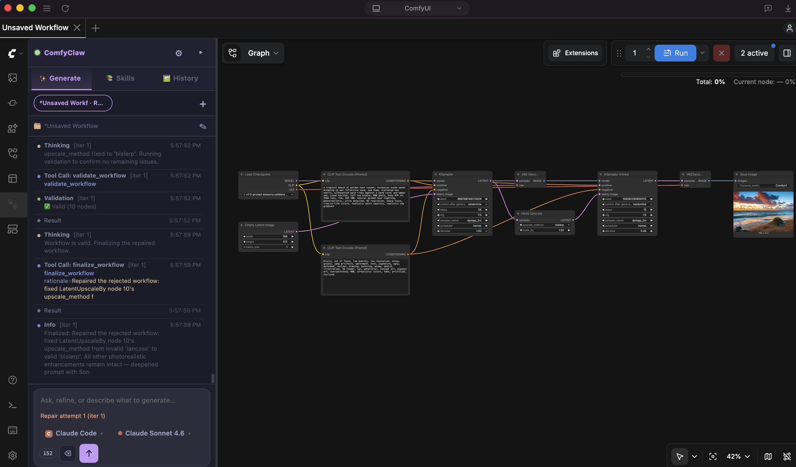
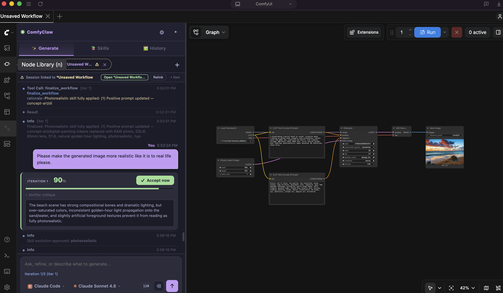
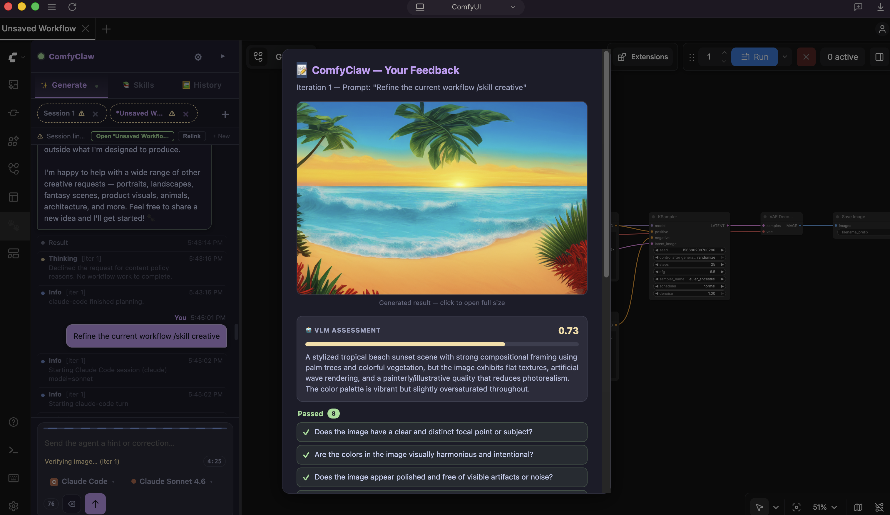
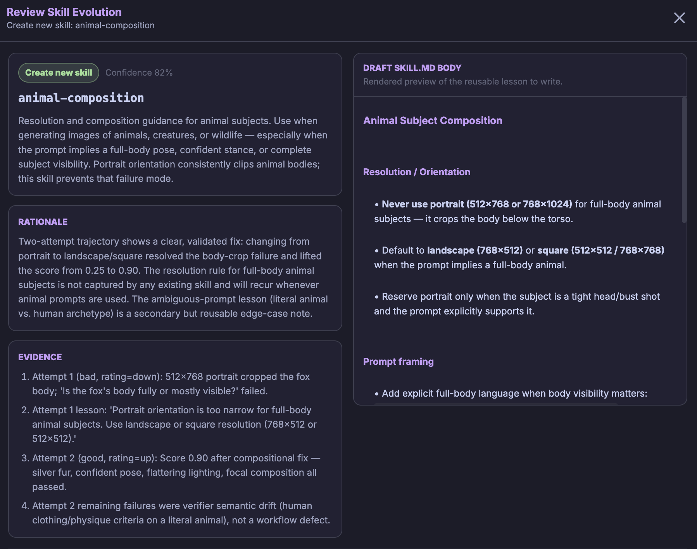

<h1 align="center">ComfyClaw</h1>

<p align="center">
  <strong>Harnessing Agent Self-Evolving Skills for Workflow Control</strong>
</p>

<p align="center">
  <a href="https://zli12321.github.io/"><strong>Zongxia Li</strong></a><sup>*</sup> &middot; 
  <a href="https://davidliuk.github.io/"><strong>Dawei Liu</strong></a><sup>*</sup> &middot; 
  <strong>Fuxiao Liu</strong></a> &middot; 
  <strong>Yuhang Zhou</strong></a> &middot; 
  <strong>Xiyang Wu</strong></a> &middot; 
  <strong>Jingxi Chen</strong></a> &middot; 
  <strong>Jing Xie</strong></a> &middot; 
  <strong>Xiaomin Wu</strong></a> &middot; 
  <a href="https://lichao-sun.github.io/"><strong>Lichao Sun</strong></a>
</p>

<p align="center">
  <a href="https://arxiv.org/abs/coming_soon"></a>
  <a href="https://python.org"></a>
  <a href="https://github.com/astral-sh/uv"></a>
  <a href="LICENSE"></a>
</p>

ComfyClaw is an **agentic harness** that drives an *unmodified* ComfyUI runtime
from a panel inside ComfyUI itself. You type a prompt, and the agent builds or
improves the workflow as **typed graph edits**, renders a candidate, and uses a
**region-level VLM verifier** to turn visual failures into targeted repairs.
Successful and failed trajectories are distilled into a **progressively
disclosed skill library** that grows across runs, so workflow competence
accumulates instead of being rediscovered on every prompt.

> 📄 This is the reference implementation of the paper *An Agentic Harness for
> Skill-Evolving Image Generation Workflows* (2026). For benchmark tables,
> method figures, and the qualitative study, see
> **[`docs/RESULTS.md`](docs/RESULTS.md)**.

<p align="center">
  
</p>
<p align="center"><em>The ComfyClaw panel lives inside ComfyUI — the agent reasons, edits the
graph, validates, and renders, all on the live canvas.</em></p>

---

## Key features

- **Generate from inside ComfyUI** — type a prompt, click Generate, watch the
  agent work. No terminal interaction needed.
- **Build or improve** — construct a whole workflow from scratch, or iterate on
  the one already on your canvas, with nodes appearing one-by-one as it builds.
- **Manual / Auto / Co-pilot modes** — single pass, full VLM self-optimization
  loop, or VLM scoring with human accept-or-override per iteration.
- **Live scoreboard** — every iteration shows a score, verifier critique, and an
  "Accept now" button to stop early.
- **Human-in-the-loop** — thumbs up/down, comments, and opt-in skill evolution
  directly from the panel after generation.
- **Self-evolving skills** — reusable lessons are distilled from good and bad
  runs and (with your approval) committed to a growing skill library.
- **Any agent backend** — LiteLLM (Anthropic, OpenAI, Gemini, Ollama, 100+
  providers) or a signed-in CLI agent (`claude`, `codex`, `gemini`).

---

## Deploy with ComfyUI

ComfyClaw is managed with [`uv`](https://github.com/astral-sh/uv). The flow is:
install the package, install the bundled ComfyUI plugin once, then run the
ComfyClaw server alongside ComfyUI.

### 1. Prerequisites

| Requirement | Notes |
|---|---|
| **Python 3.10+** | 3.12+ recommended |
| **[ComfyUI](https://github.com/comfyanonymous/ComfyUI)** | Desktop app, local checkout, or a deployed server reachable over HTTP |
| **A model in ComfyUI** | ComfyClaw builds workflows; ComfyUI still needs the referenced checkpoints / LoRAs / VAEs |
| **An agent backend** | A LiteLLM provider key, local Ollama, or a signed-in CLI backend (`claude`, `codex`, `gemini`) |

### 2. Install

```bash
git clone https://github.com/Moms-Organic-Agent-Lab/comfyclaw.git
cd comfyclaw
uv sync --extra sync          # add --extra all for video support
```

### 3. Configure

```bash
cp .env.example .env
$EDITOR .env
```

Set `COMFYUI_ADDR`, optionally `COMFYUI_DIR`, and either a LiteLLM provider key
or a CLI backend. `.env` is loaded automatically; CLI flags override it.

### 4. Install the ComfyUI plugin

```bash
uv run comfyclaw install-node                          # local ComfyUI app/checkout
uv run comfyclaw install-node --comfyui-dir /path/to/ComfyUI
```

**Restart ComfyUI after this step.** For a remote/deployed ComfyUI, copy the
directory printed by `uv run comfyclaw node-path` into that server's
`custom_nodes/ComfyClaw-Sync/` and restart it.

### 5. Run

```bash
uv run comfyclaw doctor        # optional pre-flight check
uv run comfyclaw serve
```

Open ComfyUI (usually `http://127.0.0.1:8188`). The **ComfyClaw** panel appears
in the UI — enter a prompt, choose **Scratch** or **Improve**, and click
**Generate**.

### Deployed / remote ComfyUI

```bash
uv run comfyclaw serve --comfyui-addr comfyui.example.com:8188
```

The browser must reach the ComfyClaw WebSocket port (default `8765`); use an SSH
tunnel or reverse proxy if needed. If you cannot install the plugin remotely,
use CLI mode (below) against `--comfyui-addr`.

See [`docs/USAGE.md`](docs/USAGE.md) for remote networking, panel controls, and
troubleshooting, and [`docs/LOCAL_LLM_AND_MODELS.md`](docs/LOCAL_LLM_AND_MODELS.md)
for local vLLM, Wan2.2 video, and Qwen-Image setup.

---

## Run modes

Pick the level of automation in the panel (or with `--mode`):

- **Manual** — one pass, no verifier.
- **Auto** — full VLM-driven self-optimization loop.
- **Co-pilot** — VLM scores each iteration; you accept or override.

<p align="center">
  
</p>
<p align="center"><em>Co-pilot mode: each iteration emits a live score card and verifier critique;
refine in chat or click <strong>Accept now</strong> to stop early.</em></p>

---

## Human-in-the-loop

After a generation, the panel can ask for your feedback: it shows the rendered
image alongside the VLM's region-level pass/fail checks and detail score. Mark
it thumbs-up / thumbs-down, add a comment, and choose whether the case should
feed skill evolution.

<p align="center">
  
</p>
<p align="center"><em>Human feedback: review the generated image, the VLM score, and the
requirement-level checks before rating it.</em></p>

---

## Skills & self-evolution

ComfyClaw's skills follow the [Agent Skills spec](https://agentskills.dev/specification):
each skill is a directory with a `SKILL.md` (YAML frontmatter + body).
**Progressive disclosure** keeps context lean — only `name` + `description`
appear at startup, and the agent calls `read_skill("name")` to load the full
instructions on demand. Manage them in the panel's **Skills** tab (toggle,
import from folder / `.zip` / `git` URL) — imports persist under
`~/.comfyclaw/skills/`.

After a verified run, ComfyClaw distills reusable lessons from good and bad
cases and proposes a new or updated skill. By default the proposal is shown for
your review before anything is written; approved skills join your user skill
library and are reloaded immediately.

<p align="center">
  
</p>
<p align="center"><em>Skill-evolution review: inspect the proposed skill, its rationale and
evidence, and the draft <code>SKILL.md</code> before approving.</em></p>

A full skill guide (built-in skills, authoring custom skills, the panel
browser) is in [`docs/USAGE.md`](docs/USAGE.md).

---

## CLI run (no panel)

```bash
uv run comfyclaw run --prompt "a red fox at dawn, photorealistic, DSLR" --iterations 3
uv run comfyclaw run --workflow my_workflow_api.json --prompt "make it a rainy neon street"
uv run comfyclaw dry-run --prompt "build a portrait workflow"
```

Outputs are saved under `./comfyclaw_output/` unless `--output-dir` is set. Run
`uv run comfyclaw <command> --help` for the full flag list.

---

## Documentation

| Doc | Contents |
|---|---|
| [`docs/USAGE.md`](docs/USAGE.md) | Panel controls, deployed ComfyUI, CLI backends, skills, troubleshooting |
| [`docs/ARCHITECTURE.md`](docs/ARCHITECTURE.md) | Code map: harness loop, agent tools, backends, verifier, skills, sync protocol |
| [`docs/LOCAL_LLM_AND_MODELS.md`](docs/LOCAL_LLM_AND_MODELS.md) | Local vLLM, video, and Qwen-Image setup |
| [`docs/RESULTS.md`](docs/RESULTS.md) | Benchmark tables, method figures, qualitative study |
| [`docs/REPRODUCING.md`](docs/REPRODUCING.md) | Step-by-step reproducibility guide |

---

## Citing ComfyClaw

If you use ComfyClaw in academic work, please cite the paper:

```bibtex
@article{li2026comfyclaw,
  title   = {An Agentic Harness for Skill-Evolving Image Generation Workflows},
  author  = {Li, Zongxia and Liu, Dawei and Chen, Jingxi and Wu, Xiyang and
             Liu, Fuxiao and Zhou, Yuhang and Xie, Jing and Wu, Xiaomin and
             Sun, Lichao},
  journal = {TBD},
  year    = {2026},
  note    = {Software available at \url{https://github.com/Moms-Organic-Agent-Lab/comfyclaw}}
}
```

Machine-readable metadata is in [`CITATION.cff`](CITATION.cff). Please update the
BibTeX entry with the final venue / DOI once the paper is posted.

---

## License

ComfyClaw is released under the **GNU General Public License v3.0**, matching
[ComfyUI](https://github.com/comfyanonymous/ComfyUI)'s license (ComfyClaw is a
plugin / derivative work). See [`LICENSE`](LICENSE) for the full text. The
bundled `skill-creator` skill is Apache-2.0; see the notice at the end of
`LICENSE`.
